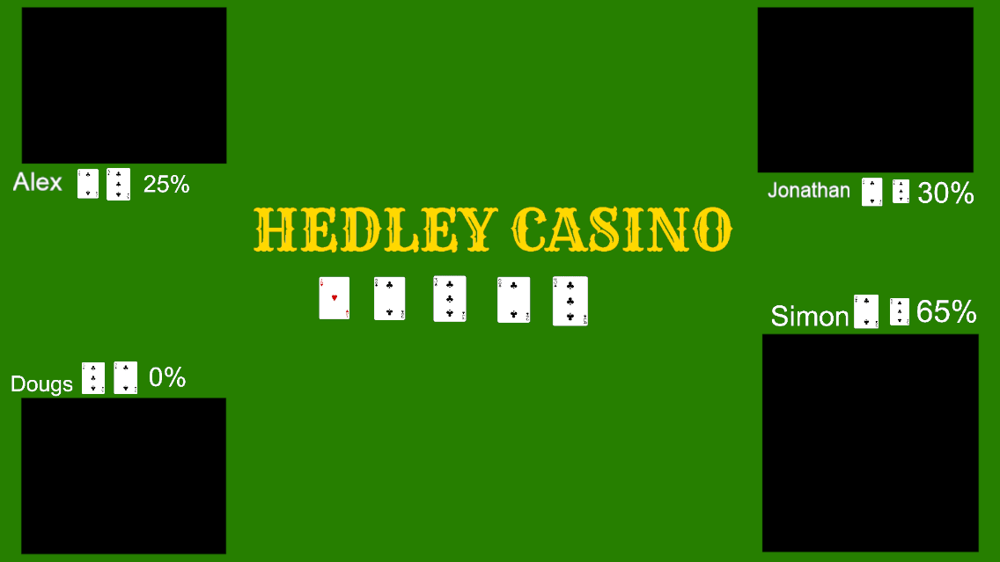

# OBS

## Scenes



- [Poker](Poker.json)

Before adding this scene to your OBS you will need to either create the same path or update this is all the places.

`"file": "D:/Twitch/Scenes/Poker/Hedley-Casino-Y.png"`

Then create a `players` folder and add the following images and text files:

(`dir /b`)

- BoardFlop1.png
- BoardFlop2.png
- BoardFlop3.png
- BoardRiver.png
- BoardTurn.png
- P1C1.png
- P1C2.png
- P2C1.png
- P2C2.png
- P3C1.png
- P3C2.png
- P4C1.png
- P4C2.png
- Player1.txt
- Player2.txt
- Player3.txt
- Player4.txt
- PotOddsPlayer1.txt
- PotOddsPlayer2.txt
- PotOddsPlayer3.txt
- PotOddsPlayer4.txt

```bash
sources
    settings
        file
```
