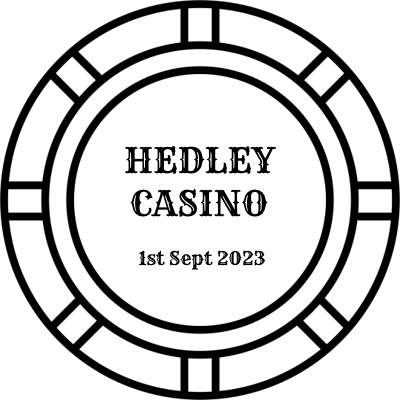

# Resources

## Poker Chip

<!--  -->

- [Poker Chip (.pdn)](PokerChip/pokerchip.pdn) - use [Paint.NET](https://www.getpaint.net/)

## OBS

- [Poker](OBS/README.md)
  - [Scene](OBS/Poker.json)

## Playing Cards

- [1](PlayingCards/README.md)
- [2](PlayingCards_2/README.md)
- [3](PlayingCards_3/README.md)

<!--  -->

")
")

## 8 Bit Deck

A few years back I bought **The 8Bit Deck: A pixel art playing card deck** from Michael B. Myers Jr. See it on my [Playing Cards](https://alexhedley.com/playingcards/) site.

I recently found that they had been made available to purchase as an assets set, $2 how could I not! Now to add them to the site.

- https://drawsgood.itch.io/8bit-deck-card-assets
- https://www.kickstarter.com/projects/drawsgood/the-8bit-deck-a-pixel-art-playing-card-deck
- https://the8bitdeck.com/

")

## Icon

- [icon](icon/README.md)
