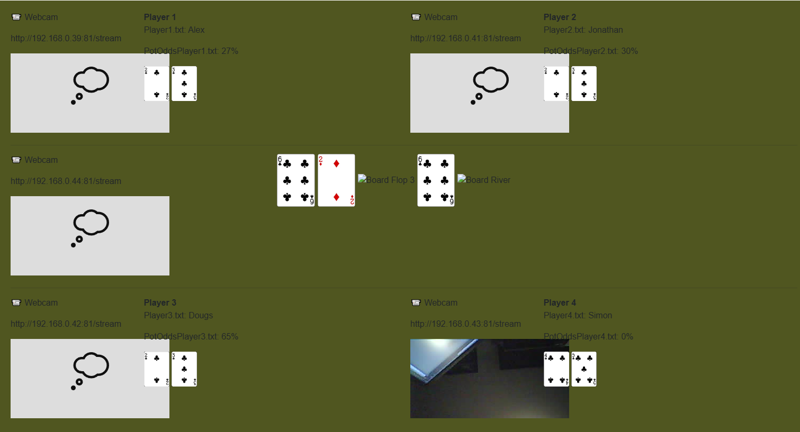

# Docs

- [PokerOddsPro](POKERODDSPRO.md)
- [PokerHandEvaluator](POKERHANDEVALUATOR.md)
- [Cards](CARDS.md)

---

Using a Blazor Server app I'm mimicing the setup I'm using for Stream to see the details in another form:

